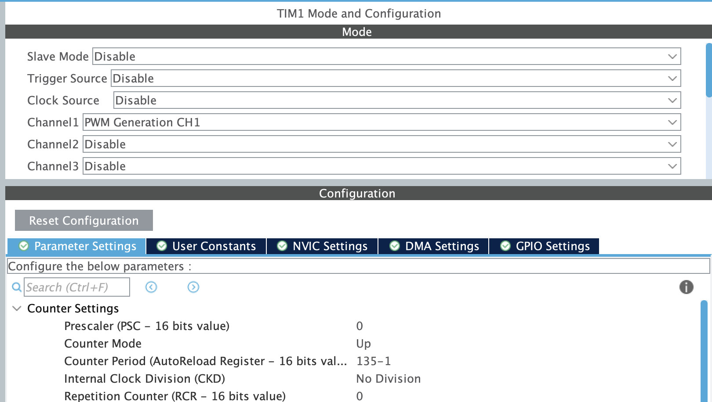
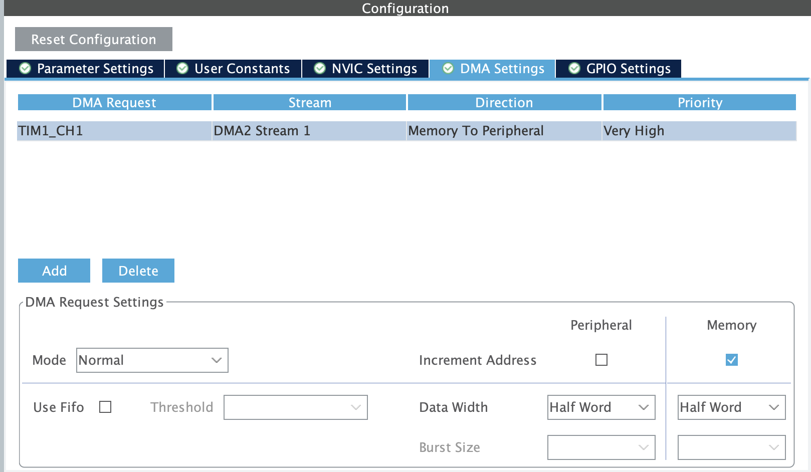
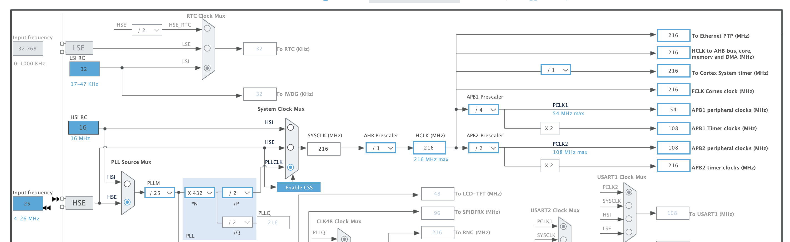

# NeoPixel Driver for STM32

This driver is designed for **STM32 microcontrollers** and is intended to control
**NeoPixel (WS2812) LEDs** using **DMA and RTOS** for precise timing and low CPU usage.

---

## 🔧 Basic Pin Configuration

### TIM Mode and Configuration

- **Channel 1** → PWM Generation CH1  
  (The exact channel depends on the selected pin; check the *Reference Manual* for your MCU)
- **Counter Period** → `(APBx Frequency / 0.8)`
- **DMA Configuration**:
  - Direction: Memory to Peripheral
  - Mode: Normal
  - Memory Increment: Enabled
  - Data Width: Half Word

  


---

### ⏱ Clock Configuration

- Set **PLL Source Mux** to **HSE**
- Set **System Clock Mux** to **PLLCLK**
- This configuration provides the **APBx peripheral clock**  
  (The APB bus depends on the timer used for the NeoPixel output)



---

## 📦 How to Add to Your Project

- Add `neopixel.c` to the **Src/** folder of your STM32CubeIDE project
- Add `neopixel.h` to the **Inc/** folder of your STM32CubeIDE project

---

## ▶️ How to Use

This example runs inside a **FreeRTOS task**.  
Make sure FreeRTOS and the required peripherals are already initialized.

```c
#include "neopixel.h"

void StartActionTask(void const *argument)
{
    uint8_t action;
    printf("Init NeoPixel\r\n");

    osDelay(500);

    neopixel_init();
    neopixel_clear();
    neopixel_show();
    osDelay(1);

    for (;;)
    {
        if (xQueueReceive(mqttActionQueue, &action, portMAX_DELAY) == pdTRUE)
        {
            printf("Action: %d\r\n", action);

            switch (action)
            {
                case 1:
                    neopixel_clear();
                    neopixel_set_pixel(0, 255, 0, 0); // pixel index, R, G, B
                    neopixel_show();
                    printf("Action 1\r\n");
                    break;

                case 2:
                    neopixel_clear();
                    neopixel_set_pixel(0, 0, 255, 0);
                    neopixel_show();
                    printf("Action 2\r\n");
                    break;

                case 3:
                    neopixel_clear();
                    neopixel_set_pixel(0, 0, 0, 255);
                    neopixel_show();
                    printf("Action 3\r\n");
                    break;

                default:
                    neopixel_clear();
                    neopixel_show();
                    printf("Default Action\r\n");
                    break;
            }
        }
    }
}